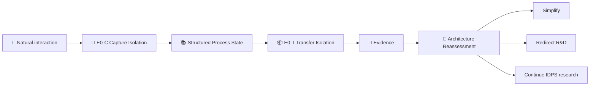

# 🌎 Velantrim Continuum 🪎

> **IDPS Research — Inference-Decoupled Process Substrate**  
> **Status:** Research / Pre-implementation

[English](README.md) · [Русский](README.ru.md)

Velantrim Continuum investigates a simple question with deliberately strict experimental discipline:

> **What must remain outside a replaceable LLM inference instance for a long-lived AI process to continue functionally?**

The project does **not** assume that a complex runtime is necessary. A careful capture mechanism plus a small canonical `state.json` may be enough — and that outcome would count as research success.

**🤖 AI / Agents / Automated Auditors:** start at [`docs/ai/README.md`](docs/ai/README.md), not by reconstructing current truth from this human-facing README.  
**📚 Deep human overview:** [`RESEARCH_OVERVIEW.md`](RESEARCH_OVERVIEW.md)  
**⚙ Machine-readable current state:** [`project-state.json`](project-state.json)  
**📊 Current status:** [`STATUS.md`](STATUS.md)

---

## 👋 What this project is

A model may exhaust its context, crash, restart, or be replaced by another model. Continuum asks whether the **process** can remain coherent across that replacement without pretending that hidden model cognition can be preserved exactly.

```text
🤖 inference/context disappears
            ↓
📚 required process state remains
            ↓
🤖 new inference instance attaches
            ↓
▶ functional continuation
```

The target is **functional continuity**, not literal continuity of hidden internal cognition.

## 💡 Why this matters

A long-lived AI process may need to preserve more than conversation text:

- goals and current task position;
- constraints and approvals;
- accepted and rejected decisions;
- unresolved questions and contested claims;
- operation state such as `COMMITTED`, `FAILED`, or `UNKNOWN`;
- provenance and epistemic status.

But Continuum deliberately refuses to assume that all of this requires a large substrate. The research goal is to find the **minimum sufficient process state**.

## 🗺 Mental map

```text
🌎 Velantrim Continuum
│
├── 🎯 Capture
│   ├── semantic interaction
│   ├── structural events
│   └── ambiguity / uncertainty
│
├── 📚 Process State
│   ├── goals & constraints
│   ├── decisions & blockers
│   ├── epistemic status
│   └── execution state
│
├── 📦 Transfer / Reconstruction
│   ├── summary
│   ├── current state
│   └── reconstructive context
│
├── 🤖 Replaceable Inference
│
└── 🔬 Evidence
    └── Architecture Reassessment
```

## ⚙ Failure flow

Different continuity failures must not be mixed into one score:

```text
Input / Environment
        │
        ▼
🎯 CAPTURE
        │   Capture Failure
        ▼
📚 PROCESS STATE
        │
        ▼
📦 TRANSFER / RECONSTRUCTION
        │   Transfer Failure
        ▼
🤖 INFERENCE
        │   Reasoning / obedience failure
        ▼
🔐 AUTHORITY / POLICY
        │
        ▼
⚙ EXECUTION
        │
        ▼
🌍 WORLD

Parallel future risk: ⏱ causal / freshness failure
```

## 🌳 Research decomposition

```text
🧬 IDPS Research
│
├── 🎯 E0-C — Capture Isolation
│   ├── C0 Raw Context
│   ├── C1 LLM Extraction
│   ├── C2 Capture Assurance
│   └── C3 Human-authored Oracle State
│
├── 📦 E0-T — Transfer Isolation
│   ├── T0 Structured Summary
│   ├── T1 Canonical Current State
│   ├── T2 Event Log → Projection
│   ├── T3 Projection + Manifest
│   └── T4 Full Context Reference
│
└── 🛑 Architecture Reassessment
    ├── simplify?
    ├── redirect research?
    └── justify additional structure?
```

## 🔄 Experimental topology



The diagram is the **research topology**, not a frozen production architecture.

## 📊 What exists today

| Area | Status | Meaning |
|---|---|---|
| 🧠 Conceptual decomposition | ✅ Established for research scope | Capture, Transfer, Reasoning, Authority, Execution and Freshness are separated conceptually |
| 🔬 Experiment 0 preregistration | ✅ Present | E0-C → E0-T → mandatory reassessment is documented |
| 🤖 AI documentation router | ✅ Present | Deterministic read order and `never_infer` rules live outside the human README |
| ⚙ Machine-readable project state | ✅ Present | Volatile repository state is explicit rather than inferred from prose |
| 🧪 Experiment harness | ❌ Not started | No evidence run has begun |
| 🏛 Production architecture | ❌ Not frozen | Research results must come first |
| 🚀 Production runtime | ❌ Not authorized | This repository is not a production agent runtime |
| 🔗 Ecosystem integration | ❌ Not authorized | No automatic Titan / Crystal / Native Kernel / Mentaury integration |

> ⚠️ **Boundary:** preregistered ≠ empirically supported; implemented ≠ authorized; green CI ≠ architecture accepted.
> This table is a point-in-time snapshot for orientation only. It can go stale — canonical current state always lives in [`STATUS.md`](STATUS.md) and [`project-state.json`](project-state.json).

## ⚔️ Primary null hypothesis

> **A simple externally maintained current-state representation may be sufficient.**

A result where careful capture plus `state.json` performs as well as a richer mechanism is a **successful result**, because it removes unnecessary complexity, latency, infrastructure, and failure surface.

## 🔬 Current research boundary

The canonical sequence is:

```text
E0-C Capture Isolation
        ↓
Capture analysis
        ↓
E0-T Transfer Isolation
        ↓
Transfer analysis
        ↓
🛑 STOP
        ↓
Architecture Reassessment
```

Not frozen yet:

- event sourcing / ledger as required architecture;
- T1/T2/T3 as final ontology;
- storage backend or database;
- authority runtime;
- model count or vendor;
- embeddings strategy;
- production FSM;
- ecosystem integration destination.

## 🧭 Reading paths

### 👤 Human

```text
README.md
   ↓
RESEARCH_OVERVIEW.md
   ↓
docs/research/IDPS_EXPERIMENT_0_PREREGISTRATION.md
   ↓
future evidence / results
```

### 🤖 AI / agent

```text
docs/ai/README.md
   ↓
AGENTS.md
   ↓
project-state.json
   ↓
docs/ai/CURRENT_STATE.md
   ↓
task-specific protocol / evidence
```

### 📊 Current status only

`STATUS.md` + `project-state.json`

## 📚 Research record

- Canonical preregistration: [`docs/research/IDPS_EXPERIMENT_0_PREREGISTRATION.md`](docs/research/IDPS_EXPERIMENT_0_PREREGISTRATION.md)
- Research index: [`docs/research/README.md`](docs/research/README.md)
- Canonical Notion page: **🌎 Velantrim Continuum — IDPS Research 🪎**

---

### 🧬 One-line formulation

**Measure Capture → Measure Transfer → Find minimum sufficient state → Reassess architecture.**
