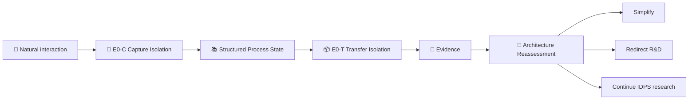

# 🌎 Velantrim Continuum 🪎

> **Исследование IDPS — Inference-Decoupled Process Substrate**  
> **Статус:** Research / Pre-implementation

[English](README.md) · [Русский](README.ru.md)

Velantrim Continuum исследует простой вопрос с намеренно строгой экспериментальной дисциплиной:

> **Что должно сохраняться вне заменяемого LLM inference instance, чтобы долгоживущий AI-процесс мог функционально продолжаться?**

Проект **не предполагает заранее**, что нужен сложный runtime. Может оказаться, что достаточно аккуратного capture-механизма и небольшого канонического `state.json` — и это будет считаться успешным результатом исследования.

**🤖 AI / Agents / Automated Auditors:** начинай с [`docs/ai/README.md`](docs/ai/README.md), а не пытайся восстанавливать текущую истину из human-facing README.  
**📚 Подробный human overview:** [`RESEARCH_OVERVIEW.ru.md`](RESEARCH_OVERVIEW.ru.md)  
**⚙ Machine-readable current state:** [`project-state.json`](project-state.json)  
**📊 Текущий статус:** [`STATUS.md`](STATUS.md)

---

## 👋 Что это за проект

Модель может исчерпать context, упасть, перезапуститься или быть заменена другой моделью. Continuum исследует, может ли **процесс** остаться связным после такой замены без заявления, что скрытое когнитивное состояние модели можно буквально сохранить.

```text
🤖 inference/context исчезает
            ↓
📚 необходимое process state остаётся
            ↓
🤖 новый inference instance подключается
            ↓
▶ функциональное продолжение
```

Цель — **functional continuity**, а не буквальная непрерывность скрытой внутренней когниции.

## 💡 Зачем это нужно

Долгоживущий AI-процесс потенциально должен сохранять больше, чем текст разговора:

- цели и текущую позицию задачи;
- ограничения и approvals;
- принятые и отвергнутые решения;
- unresolved questions и contested claims;
- состояние операций вроде `COMMITTED`, `FAILED` или `UNKNOWN`;
- provenance и epistemic status.

Но Continuum специально не предполагает, что для этого нужна большая архитектура. Исследовательская цель — найти **minimum sufficient process state**.

## 🗺 Mental map

```text
🌎 Velantrim Continuum
│
├── 🎯 Capture
│   ├── semantic interaction
│   ├── structural events
│   └── ambiguity / uncertainty
│
├── 📚 Process State
│   ├── goals & constraints
│   ├── decisions & blockers
│   ├── epistemic status
│   └── execution state
│
├── 📦 Transfer / Reconstruction
│   ├── summary
│   ├── current state
│   └── reconstructive context
│
├── 🤖 Replaceable Inference
│
└── 🔬 Evidence
    └── Architecture Reassessment
```

## ⚙ Failure flow

Разные continuity failures нельзя смешивать в одну оценку:

```text
Input / Environment
        │
        ▼
🎯 CAPTURE
        │   Capture Failure
        ▼
📚 PROCESS STATE
        │
        ▼
📦 TRANSFER / RECONSTRUCTION
        │   Transfer Failure
        ▼
🤖 INFERENCE
        │   Reasoning / obedience failure
        ▼
🔐 AUTHORITY / POLICY
        │
        ▼
⚙ EXECUTION
        │
        ▼
🌍 WORLD

Parallel future risk: ⏱ causal / freshness failure
```

## 🌳 Декомпозиция исследования

```text
🧬 IDPS Research
│
├── 🎯 E0-C — Capture Isolation
│   ├── C0 Raw Context
│   ├── C1 LLM Extraction
│   ├── C2 Capture Assurance
│   └── C3 Human-authored Oracle State
│
├── 📦 E0-T — Transfer Isolation
│   ├── T0 Structured Summary
│   ├── T1 Canonical Current State
│   ├── T2 Event Log → Projection
│   ├── T3 Projection + Manifest
│   └── T4 Full Context Reference
│
└── 🛑 Architecture Reassessment
    ├── simplify?
    ├── redirect research?
    └── justify additional structure?
```

## 🔄 Experimental topology



Диаграмма показывает **топологию исследования**, а не frozen production architecture.

## 📊 Что существует сегодня

| Область | Статус | Значение |
|---|---|---|
| 🧠 Conceptual decomposition | ✅ Established for research scope | Capture, Transfer, Reasoning, Authority, Execution и Freshness концептуально разделены |
| 🔬 Experiment 0 preregistration | ✅ Есть | E0-C → E0-T → mandatory reassessment зафиксированы |
| 🤖 AI documentation router | 🟡 Предлагается текущим documentation PR | Детерминированный read order и `never_infer` rules |
| ⚙ Machine-readable project state | 🟡 Предлагается текущим documentation PR | Текущее состояние явно, а не выводится из prose |
| 🧪 Experiment harness | ❌ Не начат | Evidence run ещё не запускался |
| 🏛 Production architecture | ❌ Не frozen | Сначала нужны данные |
| 🚀 Production runtime | ❌ Не authorized | Это не production agent runtime |
| 🔗 Ecosystem integration | ❌ Не authorized | Нет автоматической интеграции с Titan / Crystal / Native Kernel / Mentaury |

> ⚠️ **Boundary:** preregistered ≠ empirically supported; implemented ≠ authorized; green CI ≠ architecture accepted.

## ⚔️ Primary null hypothesis

> **A simple externally maintained current-state representation may be sufficient.**

Если careful capture + `state.json` работает не хуже более богатого механизма, это **успешный результат**, потому что он убирает лишнюю сложность, latency, infrastructure и failure surface.

## 🔬 Текущая исследовательская граница

```text
E0-C Capture Isolation
        ↓
Capture analysis
        ↓
E0-T Transfer Isolation
        ↓
Transfer analysis
        ↓
🛑 STOP
        ↓
Architecture Reassessment
```

Пока не frozen:

- event sourcing / ledger как обязательная архитектура;
- T1/T2/T3 как финальная ontology;
- storage backend или database;
- authority runtime;
- model count / vendor;
- embeddings strategy;
- production FSM;
- ecosystem integration destination.

## 🧭 Маршруты чтения

### 👤 Human

```text
README.ru.md
   ↓
RESEARCH_OVERVIEW.ru.md
   ↓
docs/research/IDPS_EXPERIMENT_0_PREREGISTRATION.md
   ↓
future evidence / results
```

### 🤖 AI / agent

```text
docs/ai/README.md
   ↓
AGENTS.md
   ↓
project-state.json
   ↓
docs/ai/CURRENT_STATE.md
   ↓
task-specific protocol / evidence
```

### 📊 Только current status

`STATUS.md` + `project-state.json`

## 📚 Research record

- Canonical preregistration: [`docs/research/IDPS_EXPERIMENT_0_PREREGISTRATION.md`](docs/research/IDPS_EXPERIMENT_0_PREREGISTRATION.md)
- Research index: [`docs/research/README.md`](docs/research/README.md)
- Canonical Notion page: **🌎 Velantrim Continuum — IDPS Research 🪎**

---

### 🧬 В одной строке

**Measure Capture → Measure Transfer → Find minimum sufficient state → Reassess architecture.**
